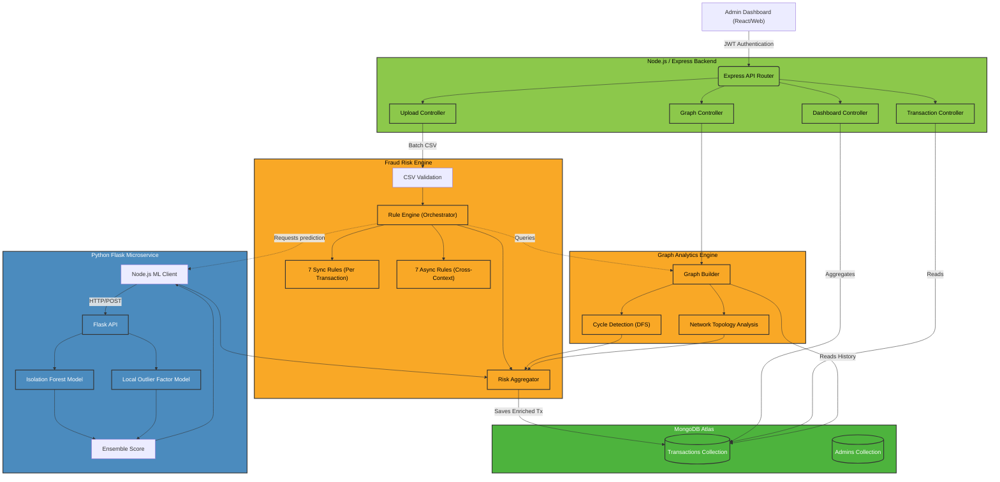

# System Architecture Diagram

This document illustrates the high-level system architecture and component interactions of FinShield-AI.

## High-Level Architecture

### Component Breakdown

1. **Express Backend**: Handles routing, JWT authentication, and request validation. Exposes endpoints for CSV uploads, dashboard analytics, and graph metrics.
2. **Fraud Risk Engine**: 
    - **Sync Rules**: Checks individual transaction properties (amount, timestamp).
    - **Async Rules**: Queries the database to identify contextual patterns (velocity, impossible travel).
3. **Graph Analytics Engine**: Builds an in-memory graph (adjacency list) to identify multi-hop money laundering cycles (e.g., A → B → C → A) and network anomalies (hubs, fan-outs).
4. **Python ML Microservice**: Exposes a Flask REST API running Scikit-Learn unsupervised anomaly detection models (Isolation Forest, Local Outlier Factor).
5. **MongoDB**: The central data store that tracks transactions, their risk scores, and identified anomalies. Heavy use of compound indexing for performance.
6. **Risk Aggregator**: Computes the final `(0-100)` risk score using weighted contributions: 50% Rules, 30% Graph, 20% ML.
