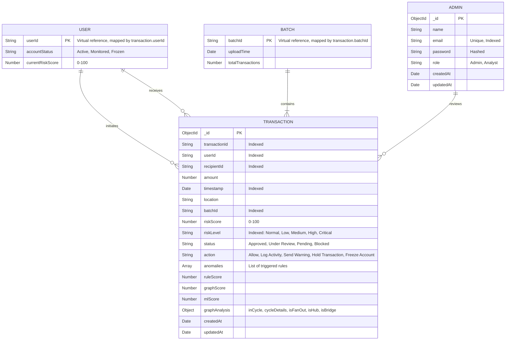

# Entity-Relationship (ER) Diagram

This document illustrates the data model for the FinShield-AI platform.

## MongoDB ER Diagram

### Explanation of Entities

1. **TRANSACTION**: The core entity storing every financial transaction. It includes base details (amount, timestamp, user/recipient), the results of the 14-rule risk engine, ML anomaly scores, and graph network metrics (cycles, fan-out, hub).
2. **USER**: A virtual entity representing the actors (senders and recipients). Risk scores for users are aggregated on-the-fly based on their transaction history.
3. **BATCH**: Represents a CSV upload batch. `batchId` tracks the provenance of transactions processed synchronously.
4. **ADMIN**: The system operators (Fraud Analysts and System Administrators) who review alerts and monitor the dashboard.
