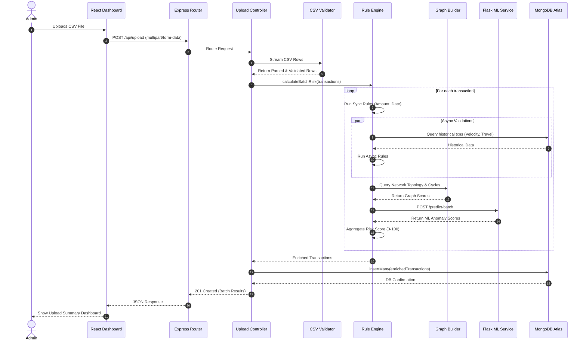

# Sequence Diagram

This document illustrates the step-by-step execution flow for processing a batch of financial transactions.

## Transaction Processing Sequence

### Flow Description

1. **Initiation**: The Admin uploads a batch of transactions via the React Dashboard.
2. **Validation**: The backend parses the CSV stream, validating headers and sanitizing row data.
3. **Evaluation**: The batch is passed to the Rule Engine.
4. **Synchronous Rules**: The engine immediately evaluates stateless rules (e.g., negative amount, future timestamp).
5. **Asynchronous Rules**: The engine queries MongoDB concurrently to establish cross-transaction context (e.g., impossible travel, dormant account).
6. **Graph Analysis**: The system analyzes the transaction graph for laundering cycles or suspicious network topologies.
7. **ML Prediction**: Features are sent to the Python microservice, which scores them using Isolation Forest and LOF models.
8. **Aggregation**: The risk aggregator weighs all inputs (Rule: 50%, Graph: 30%, ML: 20%) to assign a final `0-100` score and an action (Allow, Block, etc.).
9. **Persistence**: The enriched transactions are saved atomically to MongoDB.
10. **Response**: The frontend receives the processing statistics and updates the admin view.
